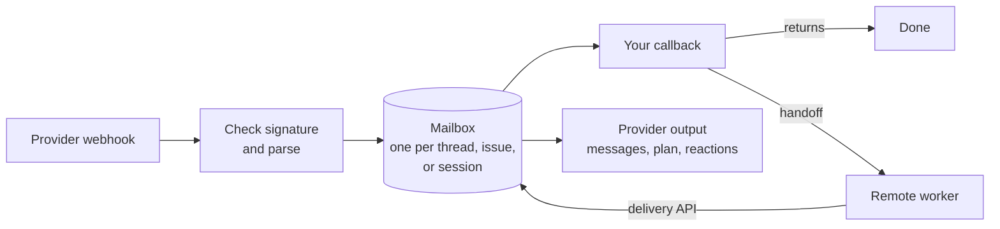
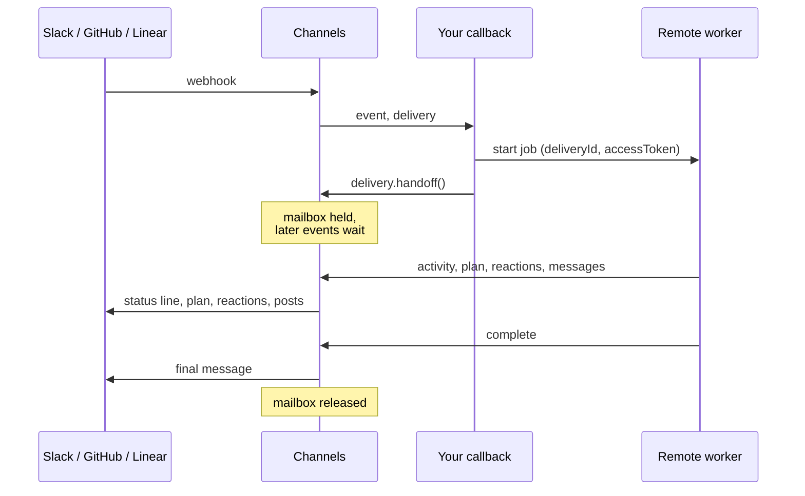

# Channels

Put your agent in Slack, GitHub, and Linear without losing a message.

Channels takes webhooks from each provider, checks them, saves them, and hands them to your callbacks in order, with retries. When the real work runs somewhere else, such as a sandbox or a job queue, your callback can **hand the delivery off**. The remote worker then reports progress, posts messages, keeps a plan, adds reactions, and finishes the turn over a small HTTP API, and Channels shows all of it in the right thread, issue, or session. Built on [Effect](https://effect.website) v4.

- **Durable.** Every event is saved before a callback sees it. A crash or a provider outage retries; nothing is dropped.
- **In order.** Events in one thread, issue, or session run one batch at a time.
- **Native per provider.** Slack callbacks get Slack threads; GitHub callbacks get issues and pull requests; Linear callbacks get issues and Agent Sessions. There is no lowest-common-denominator message type.
- **Portable output.** A remote worker's progress, messages, plans, reactions, and final answer use one API, and each provider shows them its own way.
- **Runs where you run.** Postgres, Redis, Cloudflare Durable Objects, or memory. Mount it on your Effect HTTP server, run it as a worker, or call it from plain `fetch` code.

## Try it

[`examples/alchemy-cloudflare`](./examples/alchemy-cloudflare/) is a complete bot for Slack, GitHub, and Linear on a Cloudflare Worker with Durable Objects, deployed with [Alchemy](https://alchemy.run). It includes a fake remote agent, so you can watch a handoff end to end: mention the bot with `handoff 30 plan react` and see the status line, plan, reactions, summary, and final message arrive.

```sh
cd examples/alchemy-cloudflare
cp .env.example .env   # fill in the providers you want
bun alchemy deploy
```

Its [README](./examples/alchemy-cloudflare/README.md) walks through setting up each app and lists checks to run by hand.

## How it works



1. A webhook arrives at `POST /integrations/:integration/webhook`. The provider package checks the signature and parses the event.
2. The event is saved in a **mailbox**: one Slack thread, one GitHub issue or pull request, or one Linear issue or Agent Session. Duplicates are dropped.
3. Processing claims a batch of waiting events and runs your callback with it. The batch and its run are a **delivery**.
4. The callback either finishes, or hands the delivery off. A handed-off delivery holds its mailbox until the remote worker completes or fails it, so later events wait their turn.
5. Output the remote worker asks for is saved first, then sent to the provider. If the provider is down, the output retries; your callback does not run again.

## Packages

| Package                                                         | What it is                                                                                      |
| --------------------------------------------------------------- | ----------------------------------------------------------------------------------------------- |
| [`packages/delivery`](./packages/delivery/)           | The core: `Channels.make`, mailboxes, delivery modes, handoff, the delivery API and its client. |
| [`packages/slack`](./packages/slack/)                 | `SlackBot.make`: Slack events, threads, messages, reactions, files, streaming, status line.     |
| [`packages/github`](./packages/github/)               | `GitHubBot.make`: GitHub App events, issues, pull requests, reviews, checks, and job logs.      |
| [`packages/linear`](./packages/linear/)               | `LinearBot.make`: Linear Agent Sessions, issues, comments, reactions, and files.                |
| [`packages/sql`](./packages/sql/)                               | Mailbox storage on Postgres.                                                                    |
| [`packages/redis`](./packages/redis/)                           | Mailbox storage on Redis.                                                                       |
| [`packages/alchemy-cloudflare`](./packages/alchemy-cloudflare/) | Mailbox storage on Cloudflare Durable Objects, one object per mailbox, woken by its alarm.      |

Each provider package's README covers app setup: scopes, webhook events, and credentials.

## Write callbacks

A callback is an Effect that gets two things: the provider's **event**, and the **delivery context**. If it fails with a retryable error, the same batch runs again later.

A callback can answer by itself (`thread.post`, `issue.postComment`, `session.respond`). For an agent, the usual shape is: gather what the agent needs to know, start the agent somewhere else, and hand the delivery off. The examples below do that, with `dispatchAgent` standing in for your code:

```ts
/**
 * Your code: start the agent wherever it runs, such as a job queue or a sandbox. Send it the delivery's
 * ID and token so it can report back, and key the job on `deliveryId` so a retry finds the same job.
 */
const dispatchAgent = Effect.fn('dispatchAgent')(function* (job: {
	readonly delivery: DeliveryContext
	readonly prompt: string
	readonly context: unknown
}) {
	// POST to your agent host, enqueue a job, start a sandbox…
	yield* Effect.logInfo('Dispatching agent', job.delivery.deliveryId)
})
```

### Slack

When someone mentions the bot, read the whole thread and who is in it, and send that to the agent. When a followed thread gets new messages, mark them seen and send the agent another turn.

```ts
import { DebounceDeliveryMode } from '@humanlayer/channels-delivery'
import { SlackBot, SlackReaction, type SlackContent } from '@humanlayer/channels-slack'
import { Config, Effect, Match } from 'effect'

/** The text of a Slack message, plain or Markdown. */
const slackText = (content: SlackContent) =>
	Match.valueTags(content, {
		SlackPlainTextContent: ({ text }) => text,
		SlackMarkdownContent: ({ markdown }) => markdown,
	})

const slack = SlackBot.make({
	signingSecret: Config.Redacted('SLACK_SIGNING_SECRET'),
	deliveryMode: DebounceDeliveryMode.make({ quietPeriodMs: 2_000, maxWaitMs: 10_000 }),
	handlers: {
		onNewMention: (event, delivery) =>
			Effect.gen(function* () {
				yield* event.thread.subscribe()
				yield* event.thread.startTyping()
				const [messages, participants] = yield* Effect.all([
					event.thread.listMessages(),
					event.thread.listParticipants(),
				])
				yield* dispatchAgent({
					delivery,
					prompt: slackText(event.trigger.content),
					context: {
						transcript: messages.map(
							(message) => `${message.author.fullName}: ${slackText(message.content)}`,
						),
						people: participants.filter((person) => !person.isBot).map((person) => person.fullName),
					},
				})
				return yield* delivery.handoff()
			}),
		onSubscribedThreadEvents: (event, delivery) =>
			Effect.gen(function* () {
				const newMessages = event.events.flatMap((threadEvent) =>
					Match.value(threadEvent).pipe(
						Match.tag('SlackMessageReceived', ({ message }) => [message]),
						Match.orElse(() => []),
					),
				)
				if (newMessages.length === 0) return
				yield* Effect.forEach(newMessages, (message) => message.addReaction(SlackReaction.make('eyes')), {
					discard: true,
				})
				yield* dispatchAgent({
					delivery,
					prompt: newMessages.map((message) => slackText(message.content)).join('\n'),
					context: { transcript: yield* event.thread.listMessages() },
				})
				return yield* delivery.handoff()
			}),
	},
})
```

A subscribed batch can also hold edits (`SlackMessageUpdated`), deletions, reactions added and removed, and the user stopping the agent (`SlackConversationStopped`); match on their `_tag` the same way. A thread can also post, stream a reply, upload files, read its channel and the messages before it, and unsubscribe. Messages carry their files, which the bot can download. `SlackApiLive`, the default, reads `SLACK_BOT_TOKEN`.

### GitHub

A mention arrives on an issue or a pull request, so match on which. For an issue, read it and its comments. For a pull request, read the conversation, the reviews, the inline review comments, the changed files, and the diff, all at once.

```ts
import { QueueDeliveryMode } from '@humanlayer/channels-delivery'
import { GitHubBot, GitHubId } from '@humanlayer/channels-github'
import { Config, Effect, Match } from 'effect'

const github = GitHubBot.make({
	webhookSecret: Config.Redacted('GITHUB_WEBHOOK_SECRET'),
	deliveryMode: QueueDeliveryMode.make({}),
	// What counts as a mention, and which events are the bot's own.
	bot: { mentionNames: ['my-bot'], botUserId: GitHubId.make(123456) },
	handlers: {
		onMentioned: (event, delivery) =>
			Match.valueTags(event, {
				GitHubIssueMentioned: ({ issue, trigger }) =>
					Effect.gen(function* () {
						yield* issue.subscribe()
						const [info, comments] = yield* Effect.all([issue.fetchInfo(), issue.listComments()])
						yield* dispatchAgent({
							delivery,
							prompt: Match.valueTags(trigger, {
								GitHubIssueOpened: ({ body }) => body ?? '',
								GitHubIssueCommentCreated: ({ comment }) => comment.body,
							}),
							context: {
								title: info.title,
								body: info.body,
								comments: comments.map((comment) => ({
									author: comment.author?.login,
									body: comment.body,
								})),
							},
						})
						return yield* delivery.handoff()
					}),
				GitHubPrMentioned: ({ pullRequest, trigger }) =>
					Effect.gen(function* () {
						yield* pullRequest.subscribe()
						const [info, comments, reviews, reviewComments, files, diff] = yield* Effect.all(
							[
								pullRequest.fetchInfo(),
								pullRequest.listComments(),
								pullRequest.listReviews(),
								pullRequest.listReviewComments(),
								pullRequest.listFiles(),
								pullRequest.fetchDiff(),
							],
							{ concurrency: 'unbounded' },
						)
						yield* dispatchAgent({
							delivery,
							prompt: Match.valueTags(trigger, {
								GitHubPrOpened: ({ body }) => body ?? '',
								GitHubPrCommentCreated: ({ comment }) => comment.body,
								GitHubPrReviewCommentCreated: ({ comment }) => comment.body,
							}),
							context: {
								title: info.title,
								branch: `${info.headRef} → ${info.baseRef}`,
								comments: comments.map((comment) => comment.body),
								reviews: reviews.map((review) => ({ state: review.state, body: review.body })),
								reviewComments: reviewComments.map((comment) => ({
									path: comment.path,
									diffHunk: comment.diffHunk,
									body: comment.body,
								})),
								files: files.map((file) => file.filename),
								diff,
							},
						})
						return yield* delivery.handoff()
					}),
			}),
	},
})
```

The other callbacks are `onIssueCreated`, `onPrCreated`, `onSubscribedIssueEvents`, and `onSubscribedPrEvents`. Subscribed issues and pull requests get later comments, reviews, inline review comments, state changes, and completed checks. Pull requests can also list commits, reply to review comments, manage labels, merge, and read GitHub Actions job logs. Check that the author may ask anything of the bot first: on a public repository anyone can comment (`issue.fetchUserAccess(login)`; see [`AuthorAccess.ts`](./examples/alchemy-cloudflare/src/AuthorAccess.ts)). `GitHubApiLive` reads `GITHUB_APP_ID` and `GITHUB_PRIVATE_KEY`. See the [`github` README](./packages/github/) for permissions and why `mentionNames` exists.

### Linear

Mentioning or delegating to the app starts an Agent Session. Linear sends `promptContext`, the issue and its thread already formatted for an agent, plus any guidance the workspace set. Read the issue's comments too if the agent wants them. A reply in the session is a new turn; Stop arrives as a prompt with `signal: 'stop'`.

```ts
import { LinearAuth, LinearBot, LinearOrganizationId, LinearUserId } from '@humanlayer/channels-linear'
import { Config, Effect } from 'effect'

const linear = LinearBot.make({
	webhookSecret: Config.Redacted('LINEAR_WEBHOOK_SECRET'),
	bot: Config.all({
		organizationId: Config.schema(LinearOrganizationId, 'LINEAR_ORGANIZATION_ID'),
		appUserId: Config.schema(LinearUserId, 'LINEAR_APP_USER_ID'),
	}),
	auth: LinearAuth.fromEnvironment,
	handlers: {
		onAgentSessionCreated: (event, delivery) =>
			Effect.gen(function* () {
				const comments = yield* event.issue.listComments()
				yield* dispatchAgent({
					delivery,
					prompt: event.promptContext ?? event.issue.title ?? '',
					context: {
						issue: event.issue.identifier,
						description: event.issue.description,
						comments: comments.map((comment) => ({
							author: comment.author?.name,
							body: comment.content.markdown,
						})),
						guidance: event.guidance.map((guidance) => guidance.body),
					},
				})
				return yield* delivery.handoff()
			}),
		onAgentSessionPrompted: (event, delivery) =>
			Effect.gen(function* () {
				if (event.prompt.signal === 'stop') return
				yield* dispatchAgent({
					delivery,
					prompt: event.prompt.body,
					context: { issue: event.issue.identifier },
				})
				return yield* delivery.handoff()
			}),
	},
})
```

Linear shows "Working on this…" before the callback runs, and runs each turn as soon as it arrives, so the bot always answers within Linear's ten seconds. The other callbacks are `onIssueCreated` and `onSubscribedEvent`. Issues can also list attachments, look up users, upload files, and change their fields.

### The delivery context

Every callback's second argument describes the delivery it is running:

| Field            | What it is                                                                                                    |
| ---------------- | ------------------------------------------------------------------------------------------------------------- |
| `deliveryId`     | Stays the same across retries. Use it as the idempotency key for any job you start.                           |
| `conversationId` | Stays the same across deliveries in one thread, issue, or session. Use it to find your agent's state.         |
| `accessToken`    | A secret that lets a remote worker act on this one delivery. Pass it on; never log it.                        |
| `handoff()`      | Hand the delivery to a remote worker. Call it after the remote job has started, and return what it gives you. |

`dispatchAgent` gets the whole context, so the agent host can read `deliveryId`, `conversationId`, and `Redacted.value(delivery.accessToken)` from it. [Hand off to a remote agent](#hand-off-to-a-remote-agent) shows what the agent does with them.

## Mount it on your API

Pick a store, then join everything with `Channels.make`. You get webhook routes (`bot.routes`) and, if you hand off, the delivery API (`bot.deliveryApi`). Mount both next to your own routes.

```ts
import { createServer } from 'node:http'
import * as NodeCrypto from '@effect/platform-node/NodeCrypto'
import * as NodeHttpServer from '@effect/platform-node/NodeHttpServer'
import * as NodeRuntime from '@effect/platform-node/NodeRuntime'
import { PgClient } from '@effect/sql-pg'
import { Channels } from '@humanlayer/channels-delivery'
import { ChannelsSql } from '@humanlayer/channels-sql'
import { Config, Layer } from 'effect'
import { HttpRouter, HttpServerResponse } from 'effect/http'

const bot = Channels.make({
	namespace: 'my-app',
	// Webhooks land at /api/channels/integrations/:integration/webhook,
	// and the delivery API at /api/channels/deliveries/...
	basePath: '/api/channels',
	providers: [slack, github, linear],
	eventProcessing: {
		// How many mailboxes this process works on at once.
		concurrency: 8,
		// Tries per batch before it is marked failed. A batch that crashes the process counts too.
		maxAttempts: 5,
		// How long a claim lasts without renewal. It renews while a callback runs, so this limits
		// how long a crashed worker's batch waits, not how long a callback may take.
		leaseMs: 30_000,
	},
	// Postgres has nothing to wake processing, so it polls.
	storage: ChannelsSql.make({ claimLimit: 50, runMigrations: true, polling: { intervalMs: 1_000 } }),
})

const MyRoutes = HttpRouter.add('GET', '/health', HttpServerResponse.text('ok'))

const Server = HttpRouter.serve(Layer.mergeAll(MyRoutes, bot.routes, bot.deliveryApi), {
	// Delivery IDs are longer than the router's default path parameter limit.
	routerConfig: Channels.routerConfig,
}).pipe(
	Layer.provide(NodeHttpServer.layer(createServer, { port: 3000 })),
	Layer.provide(NodeCrypto.layer),
	Layer.provide(PgClient.layerConfig({ url: Config.Redacted('DATABASE_URL') })),
)

Layer.launch(Server).pipe(NodeRuntime.runMain)
```

The routes bring mailbox processing with them. For other setups:

```ts
// A worker that processes mailboxes but serves no HTTP.
Layer.launch(bot.layer.pipe(Layer.provide(services)))

// Without Effect: a plain Request to Response function, for Bun.serve, Hono, Next.js, and so on.
const started = await bot.start(services, bot.deliveryApi)
Bun.serve({ port: 3000, fetch: started.handle })
// later: await started.stop()
```

Nothing runs until one of these is built, and a program that uses more than one still gets one polling loop.

| Store      | Package                                                         | Call                      |
| ---------- | --------------------------------------------------------------- | ------------------------- |
| Postgres   | [`packages/sql`](./packages/sql/)                               | `ChannelsSql.make`        |
| Redis      | [`packages/redis`](./packages/redis/)                           | `ChannelsRedis.make`      |
| Memory     | [`packages/delivery`](./packages/delivery/)           | `ChannelsMemory.make`     |
| Cloudflare | [`packages/alchemy-cloudflare`](./packages/alchemy-cloudflare/) | `ChannelsCloudflare.make` |

Every store supports handoff. Memory is for tests and local work: it forgets everything when the process stops.

### On Cloudflare

On Cloudflare the Worker takes webhooks and the mailbox Durable Object runs callbacks from its alarm. `ChannelsCloudflare.make` takes the same options without `storage`, and gives you a piece for each.

```ts
// Bot.ts: one declaration for both halves.
export const bot = ChannelsCloudflare.make({ namespace, providers: [slack, github, linear], eventProcessing })

// DeliveryMailboxDO.ts: your Durable Object class, one per mailbox.
export class DeliveryMailbox extends Cloudflare.DurableObject<DeliveryMailbox, MailboxMethods>()('DeliveryMailbox') {}
export const DeliveryMailboxLive = DeliveryMailbox.make(bot.mailbox({ rearmAfterMs: 1_000 }))

// Worker.ts: webhooks and the delivery API, routed to the right mailbox object.
const Routes = Layer.mergeAll(bot.routes, bot.deliveryApi, MyRoutes).pipe(
	Layer.provide(Layer.effect(DeliveryMailboxes, DeliveryMailbox)),
)
export default Cloudflare.Worker(
	'IngressWorker',
	{ main: import.meta.url },
	Effect.gen(function* () {
		return { fetch: yield* ChannelsCloudflare.serve(Routes) }
	}).pipe(Effect.provide(DeliveryMailboxLive.pipe(Layer.provideMerge(NodeCrypto.layer)))),
)
```

The mailbox class may carry methods of its own, but not its own alarm: a Durable Object has one, and the mailbox uses it. See [`examples/alchemy-cloudflare/src`](./examples/alchemy-cloudflare/src/) for the full files.

## Hand off to a remote agent

A callback should not run an agent for twenty minutes. Instead it starts the job somewhere else, hands the delivery off, and returns. The remote worker then drives the conversation through the **delivery API**, using the delivery's ID and token.



Every request answers `202` once it is saved; Channels sends it to the provider afterwards and retries on its own. Sending the same request twice answers `already_recorded` and changes nothing, so the remote worker can retry freely.

### In the callback

The callbacks above call `delivery.handoff()` with no options. It can also carry links and a time limit:

```ts
onAgentSessionCreated: (event, delivery) =>
	Effect.gen(function* () {
		// Here `dispatchAgent` answers with the run's page.
		const job = yield* dispatchAgent({ delivery, prompt: event.promptContext ?? '', context: {} })
		return yield* delivery.handoff({
			// Shown on the delivery where the provider can, such as a Linear session.
			links: [ExternalLink.make({ label: 'Run log', url: job.url })],
			// Fail the delivery if the worker goes quiet this long. Defaults to 24 hours.
			failAfter: '2 hours',
		})
	}),
```

### In the remote worker

`makeDeliveryClient` is a typed client built from the same API definition the server serves.

```ts
import {
	DeliveryActivity,
	DeliveryPlanItemId,
	DeliveryPlanItemState,
	DeliveryReactionTarget,
	makeDeliveryClient,
	MessageId,
} from '@humanlayer/channels-delivery'
import { Effect, Redacted } from 'effect'
import { FetchHttpClient } from 'effect/http'

const runJob = (job: { deliveryId: string; accessToken: string }) =>
	Effect.gen(function* () {
		const api = yield* makeDeliveryClient({ baseUrl: 'https://agent.example.com', basePath: '/api/channels' })
		const target = { deliveryId: job.deliveryId, accessToken: Redacted.make(job.accessToken) }
		const { Pending, InProgress, Completed } = DeliveryPlanItemState.cases

		// What the provider supports here, and whether the user asked to stop.
		const status = yield* api.status(target)
		if (status.interruptRequested) return yield* api.fail({ ...target, payload: { markdown: 'Stopped.' } })

		// Progress that changes: Slack's status line, a Linear thought, GitHub's eyes reaction.
		yield* api.activity.set({
			...target,
			activity: DeliveryActivity.cases.Working.make({ message: 'Reading the logs' }),
		})

		// A task list, sent whole each time. Slack's plan block, Linear's Agent Plan, or one GitHub comment.
		yield* api.plan.put({
			...target,
			plan: {
				title: 'Fix the flaky test',
				items: [
					{ id: DeliveryPlanItemId.make('read'), title: 'Read the logs', state: InProgress.make({}) },
					{ id: DeliveryPlanItemId.make('fix'), title: 'Write a fix', state: Pending.make({}) },
				],
			},
		})

		// A reaction on what started the delivery.
		yield* api.reactions.set({
			...target,
			reaction: 'rocket',
			target: DeliveryReactionTarget.cases.ActivationTarget.make({}),
			active: true,
		})

		// Lasting messages, named by you so you can edit or delete them later.
		const notes = MessageId.make('notes')
		yield* api.messages.create({ ...target, message: { messageId: notes, markdown: 'Found it: a race in setup.' } })
		yield* api.messages.update({ ...target, messageId: notes, message: { markdown: 'Fixed a race in setup.' } })

		// End the turn. Or ask a question: { awaitingInput: { options: ['staging', 'production'] } }
		yield* api.complete({ ...target, payload: { markdown: 'Opened a pull request with the fix.' } })
	}).pipe(Effect.provide(FetchHttpClient.layer))
```

It is plain HTTP, so a worker in any language can do the same:

```sh
curl -X PUT "$BASE/api/channels/deliveries/$DELIVERY_ID/activity" \
  -H "Authorization: Bearer $ACCESS_TOKEN" -H 'content-type: application/json' \
  -d '{"activity":{"_tag":"Working","message":"Reading the logs"}}'

curl -X POST "$BASE/api/channels/deliveries/$DELIVERY_ID/complete" \
  -H "Authorization: Bearer $ACCESS_TOKEN" -H 'content-type: application/json' \
  -d '{"markdown":"Opened a pull request with the fix."}'
```

### The delivery API

| Request                                  | Does                                                                            |
| ---------------------------------------- | ------------------------------------------------------------------------------- |
| `GET /deliveries/:id`                    | Stage, supported operations, reaction targets, plan, output progress, stop flag |
| `PUT /deliveries/:id/activity`           | Show `Working` with a short line, or `Idle`. The latest wins.                   |
| `PUT /deliveries/:id/plan`               | Replace the plan                                                                |
| `PUT /deliveries/:id/reactions/:name`    | Add or remove the bot's reaction on the activation target or a message          |
| `POST /deliveries/:id/messages`          | Post a message                                                                  |
| `PATCH /deliveries/:id/messages/:msgId`  | Edit it                                                                         |
| `DELETE /deliveries/:id/messages/:msgId` | Delete it                                                                       |
| `POST /deliveries/:id/links`             | Add a link                                                                      |
| `POST /deliveries/:id/complete`          | End with an answer, or with a question (`awaitingInput`)                        |
| `POST /deliveries/:id/fail`              | End with an error                                                               |

Reactions come from a small set every provider can show: `thumbs_up`, `thumbs_down`, `laugh`, `confused`, `heart`, `hooray`, `rocket`, `eyes`. A wrong token and an unknown delivery both answer `404`, so callers cannot learn which deliveries exist. An operation the destination cannot show answers `409`; check `supportedOperations` first.

### How each provider shows it

| Request         | Slack                          | GitHub                                     | Linear session                     | Linear issue              |
| --------------- | ------------------------------ | ------------------------------------------ | ---------------------------------- | ------------------------- |
| activity        | thread status line             | bot's `eyes` on what started it            | ephemeral thought                  | not supported             |
| plan            | one plan block message         | one comment, edited in place               | Agent Plan                         | one comment               |
| reactions       | on the mention or a message    | on the comment, issue, or PR, or a message | on the mentioning comment or issue | on the issue or a message |
| messages        | thread replies                 | comments                                   | lasting thoughts (no edit/delete)  | comments                  |
| links           | not shown yet                  | not shown yet                              | link on the session                | not shown yet             |
| complete / fail | final reply, clears the status | final comment, removes `eyes`              | `response`, `error`, `elicitation` | final comment             |

The provider READMEs give the details: [Slack](./packages/slack/), [GitHub](./packages/github/#remote-delivery), [Linear](./packages/linear/#remote-delivery).

## Delivery modes

A delivery mode decides when a mailbox runs and which waiting events form the batch. Set it per provider with `deliveryMode`.

| Mode       | When it runs                                                                                                        | What the callback gets     |
| ---------- | ------------------------------------------------------------------------------------------------------------------- | -------------------------- |
| `Queue`    | As soon as an event arrives                                                                                         | Everything that is waiting |
| `Serial`   | As soon as an event arrives                                                                                         | One event, oldest first    |
| `Debounce` | After the mailbox has been quiet for `quietPeriodMs`. Each new event restarts the wait; `maxWaitMs` caps the total. | Everything that is waiting |
| `Burst`    | A fixed `windowMs` after the first waiting event                                                                    | Everything that is waiting |

`Debounce` suits chat, where people send three short messages in a row. With A, B, and C waiting, `Serial` calls back three times and `Queue` once with all three.

## What you can rely on

- **At least once.** A callback can run again for the same batch: after a retryable failure, or after the process died mid-run. Make callbacks safe to repeat, and key remote jobs on `deliveryId`.
- **In order within a mailbox.** One batch at a time, events in arrival order. A retried or handed-off batch keeps its events; newer ones wait behind it.
- **Output retries, not callbacks.** Once a remote worker's request is saved, a provider outage retries the output alone. Edits, deletes, reactions, and plans are safe to repeat; a new post can show twice if the process dies right after the provider accepts it.
- **Crash recovery.** A claim whose worker stops renewing it is picked up by another worker after `leaseMs`. Keep `leaseMs` well above any clock drift between your machines.
- **No secrets at rest.** Provider credentials never go into mailboxes, and the delivery API never returns provider IDs or tokens.

## Development

```sh
bun install
bun run typecheck
bun run test
bun run check      # lint + typecheck
bun run format
```

`bun run test` needs no database, no credentials, and no network.

Every store must pass one shared suite, [`packages/delivery/test/backend-contract.ts`](./packages/delivery/test/backend-contract.ts). The Postgres and Redis runs live in `packages/sql/test-backends` and `packages/redis/test-backends`, and are left out of `bun run test` because they need a real database.
