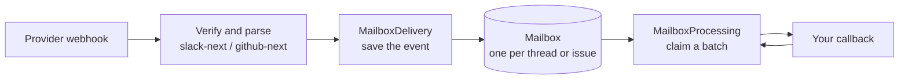

# Channels

Receive events from Slack and GitHub, save them durably, and hand them to your callbacks in order, with retries. Built on [Effect](https://effect.website) v4.

There is no universal provider facade and no agent engine. Slack callbacks get Slack types; GitHub callbacks get GitHub types. What the providers share is delivery: how an event is saved, batched, claimed, retried and recovered.

## How it works



1. A webhook arrives at `POST /integrations/:integration/webhook`. The provider package checks the signature and parses the event.
2. `MailboxDelivery` saves the event in a **mailbox**. A mailbox is one Slack thread or one GitHub issue or pull request. Duplicate events are dropped.
3. `MailboxProcessing` claims a batch of waiting events from the mailbox and runs your callback with it.
4. The result is saved. A retryable failure runs the same batch again later. Events that arrived during the run wait for the next batch.

One mailbox runs one batch at a time, so events in a thread are handled in order. Different mailboxes run at the same time.

## Packages

| Package                                                         | What it is                                                                                                                                                                 |
| --------------------------------------------------------------- | -------------------------------------------------------------------------------------------------------------------------------------------------------------------------- |
| [`packages/delivery-next`](./packages/delivery-next/)           | The shared core: `Channels.make`, the webhook route, `MailboxDelivery`, `MailboxProcessing`, delivery modes, and `MailboxSubscriptions`. Knows nothing about any database. |
| [`packages/slack-next`](./packages/slack-next/)                 | `SlackBot.make`: Slack signature check, event parsing, the `SlackApi` service, and the Slack callbacks.                                                                    |
| [`packages/github-next`](./packages/github-next/)               | `GitHubBot.make`: GitHub signature check, event parsing, the `GitHubApi` service, and the GitHub callbacks.                                                                |
| [`packages/sql`](./packages/sql/)                               | Mailbox storage on Postgres.                                                                                                                                               |
| [`packages/redis`](./packages/redis/)                           | Mailbox storage on Redis.                                                                                                                                                  |
| [`packages/alchemy-cloudflare`](./packages/alchemy-cloudflare/) | Mailbox storage on Cloudflare Durable Objects, one object per mailbox, woken by its alarm.                                                                                 |
| [`examples/alchemy-cloudflare`](./examples/alchemy-cloudflare/) | Slack and GitHub Apps on a Cloudflare Worker and Durable Objects.                                                                                                          |

`packages/delivery`, `packages/slack` and `packages/github` are the earlier versions. They still build and their tests still run, but new work goes in the `-next` packages, and the rest of this file describes only those.

## Callbacks

You write callbacks per provider. Each one is an Effect. If it fails with a retryable error, the same batch runs again later.

### Slack

```ts
import { DebounceDeliveryMode } from '@humanlayer/channels-delivery-next'
import { SlackBot, SlackContent, SlackReaction } from '@humanlayer/channels-slack-next'
import { Config, Effect, Predicate } from 'effect'

const slack = SlackBot.make({
	signingSecret: Config.redacted('SLACK_SIGNING_SECRET'),
	deliveryMode: DebounceDeliveryMode.make({ quietPeriodMs: 2_000, maxWaitMs: 10_000 }),
	handlers: {
		// The bot was mentioned in a thread it has not subscribed to.
		// `event.events` holds anything that arrived after the mention.
		onNewMention: (event) =>
			Effect.gen(function* () {
				yield* event.thread.subscribe()
				yield* event.thread.startTyping()
				yield* event.thread.post(SlackContent.make({ markdown: 'On it.' }))
			}),

		// One or more events in a thread the bot has subscribed to, in order.
		// How many arrive together depends on the delivery mode.
		onSubscribedThreadEvents: (event) =>
			Effect.gen(function* () {
				for (const threadEvent of event.events) {
					if (Predicate.isTagged(threadEvent, 'SlackMessageReceived')) {
						yield* threadEvent.message.addReaction(SlackReaction.make('eyes'))
					}
				}
			}),
	},
})
```

A thread can also list its messages and participants, and unsubscribe. For anything else, such as streaming a reply, use the `SlackApi` service. By default the bot talks to Slack through `SlackApiLive`, which reads `SLACK_BOT_TOKEN`; pass `slackApi` to use your own layer.

### GitHub

```ts
import { QueueDeliveryMode } from '@humanlayer/channels-delivery-next'
import { GitHubBot, GitHubId } from '@humanlayer/channels-github-next'
import { Config, Effect } from 'effect'

const github = GitHubBot.make({
	webhookSecret: Config.redacted('GITHUB_WEBHOOK_SECRET'),
	deliveryMode: QueueDeliveryMode.make({}),
	// What counts as a mention of this bot, and which events are the bot's own.
	bot: { mentionNames: ['my-bot'], botUserId: GitHubId.make(123456) },
	handlers: {
		onIssueCreated: (event) => event.issue.subscribe().pipe(Effect.asVoid),
		onMentioned: () => Effect.logInfo('Mentioned'),
		// Also: onPrCreated, onSubscribedIssueEvents, onSubscribedPrEvents
	},
})
```

By default the bot talks to GitHub through `GitHubApiLive`, which reads `GITHUB_APP_ID` and `GITHUB_PRIVATE_KEY`; pass `gitHubApi` to use your own layer. Creation and text-invocation callbacks can subscribe an issue or pull request so later comments, reviews, lifecycle changes, and completed checks reach its subscribed callback. A completed check associated with several pull requests is delivered to each pull request mailbox.

GitHub App bot accounts are not native mentionable users. `mentionNames` controls provider-side text matching, so an app configured with `mentionNames: ['my-bot']` recognizes `@my-bot` even when GitHub renders it as plain text. See the [`github-next` setup guide](./packages/github-next/) for the required permissions and webhook events, or the [Alchemy example](./examples/alchemy-cloudflare/) for a complete app.

## Delivery modes

A delivery mode decides when a mailbox runs and which waiting events form the batch. You set it per provider with `deliveryMode`. There is no default.

| Mode       | When it runs                                                                                                                          | What the callback gets     |
| ---------- | ------------------------------------------------------------------------------------------------------------------------------------- | -------------------------- |
| `Queue`    | As soon as an event arrives                                                                                                           | Everything that is waiting |
| `Serial`   | As soon as an event arrives                                                                                                           | One event, oldest first    |
| `Debounce` | After the mailbox has been quiet for `quietPeriodMs`. Each new event restarts the wait. The optional `maxWaitMs` caps the total wait. | Everything that is waiting |
| `Burst`    | A fixed `windowMs` after the first waiting event                                                                                      | Everything that is waiting |

`Queue` and `Serial` differ only when events pile up during a run. With A, B and C waiting, `Serial` calls back three times and `Queue` calls back once with all three.

## Wiring it up

Pick a storage, then join everything with `Channels.make`.

```ts
import * as NodeCrypto from '@effect/platform-node/NodeCrypto'
import { PgClient } from '@effect/sql-pg'
import { Channels } from '@humanlayer/channels-delivery-next'
import { ChannelsSql } from '@humanlayer/channels-sql'
import { Layer } from 'effect'

const bot = Channels.make({
	namespace: 'my-app',
	// Optional. The webhook path becomes /api/channels/integrations/:integration/webhook.
	basePath: '/api/channels',
	providers: [slack, github],
	eventProcessing: {
		// How many mailboxes this process works on at once.
		concurrency: 8,
		// Tries per batch before it is marked failed. A batch that crashes the process counts too.
		maxAttempts: 5,
		// How long a claim stays ours without a renewal. It is renewed while a callback runs,
		// so this limits how long a crashed worker's batch waits, not how long a callback may take.
		leaseMs: 30_000,
	},
	// Postgres has nothing to wake processing, so it polls.
	storage: ChannelsSql.make({ claimLimit: 50, runMigrations: true, polling: { intervalMs: 1_000 } }),
})

const services = Layer.merge(NodeCrypto.layer, PgClient.layer({ url }))
```

`bot` gives you three ways to run it. Nothing runs until one of them is built, and a program that uses more than one still gets one polling loop.

```ts
// 1. In an Effect HTTP server: mount the routes next to your own.
//    The routes bring mailbox processing with them.
HttpRouter.serve(Layer.mergeAll(myRoutes, bot.routes)).pipe(Layer.provide(services))

// 2. In a process that serves no HTTP, such as a separate worker machine.
Layer.launch(bot.layer.pipe(Layer.provide(services)))

// 3. Without Effect: a plain Request to Response function.
const started = await bot.start(services)
const response = await started.handle(request)
await started.stop()
```

| Storage    | Package                                                         | Call                      |
| ---------- | --------------------------------------------------------------- | ------------------------- |
| Postgres   | [`packages/sql`](./packages/sql/)                               | `ChannelsSql.make`        |
| Redis      | [`packages/redis`](./packages/redis/)                           | `ChannelsRedis.make`      |
| Memory     | [`packages/delivery-next`](./packages/delivery-next/)           | `ChannelsMemory.make`     |
| Cloudflare | [`packages/alchemy-cloudflare`](./packages/alchemy-cloudflare/) | `ChannelsCloudflare.make` |

Memory is for tests and local development: everything is lost when the process stops.

### Cloudflare

On Cloudflare the two halves run in different places, and your application declares both classes. `ChannelsCloudflare.make` takes the same options without `storage`, and gives you one piece for each class.

```ts
const bot = ChannelsCloudflare.make({ namespace, providers: [slack, github], eventProcessing })

// Your Durable Object class: one per mailbox, woken by its alarm.
export class DeliveryMailbox extends Cloudflare.DurableObject<DeliveryMailbox>()(
	'DeliveryMailbox',
	Effect.succeed(bot.mailbox({ rearmAfterMs: 1_000 })),
) {}

// Your Worker: serve the webhook routes alone, or mount `ingress.routes` on your own router.
const mailboxes = yield * DeliveryMailbox
const fetch = yield * bot.ingress(mailboxes).fetch.pipe(Effect.provide(NodeCrypto.layer))
```

The Durable Object class can carry methods of your own, but not its own alarm: a Durable Object has one alarm, and the mailbox uses it. See [`examples/alchemy-cloudflare`](./examples/alchemy-cloudflare/) for the complete app.

Underneath, each storage package provides the same three services: `MailboxDelivery` for the webhook side, `MailboxProcessingBackend` for the processing side, and `MailboxSubscriptions`. You can still wire `webhookRoutes`, `MailboxProcessingLive` and `ProviderEventDispatcherLive` by hand.

## What you can rely on

- **At least once.** A callback can run again for the same batch: after a retryable failure, or after the process died mid-run. Make callbacks safe to repeat.
- **In order within a mailbox.** One batch at a time, events in arrival order. A retried batch keeps its events; newer events wait behind it.
- **No lost events between look and claim.** Processing reads what is waiting, decides, then claims "events up to number N". An event that arrives in between has a higher number and waits for the next batch.
- **Crash recovery.** A claim whose worker stops renewing it is picked up by another worker after `leaseMs`.

Each worker uses its own clock to judge when a claim has timed out. Keep `leaseMs` well above any clock drift between your machines.

## Development

```sh
bun install
bun run typecheck
bun run test
bun run check      # lint + typecheck
bun run format
```

`bun run test` needs no database, no credentials and no network.

Every storage package must pass one shared suite, [`packages/delivery-next/test/backend-contract.ts`](./packages/delivery-next/test/backend-contract.ts). The Postgres and Redis runs of it live in `packages/sql/test-backends` and `packages/redis/test-backends`, and are left out of `bun run test` because they need a real database.
