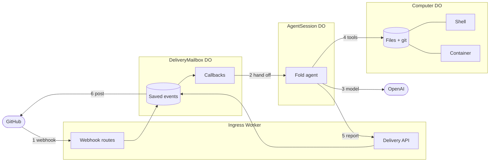
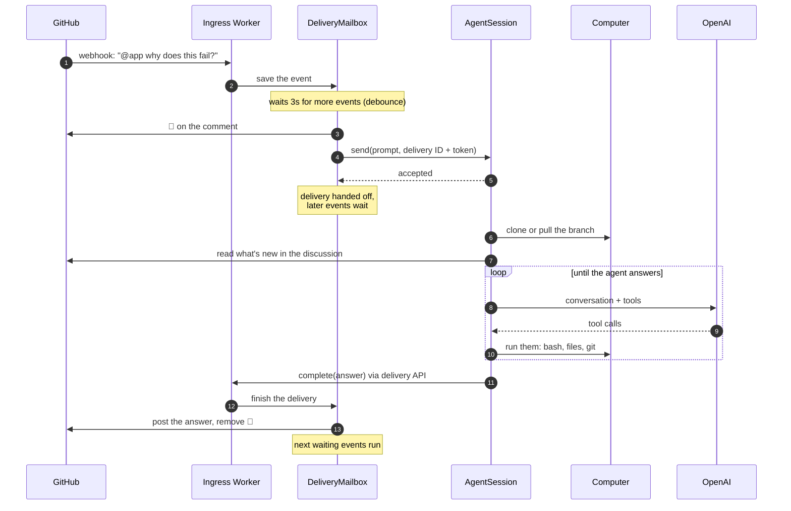
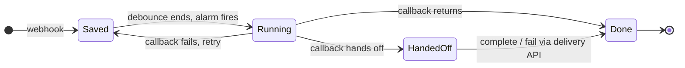
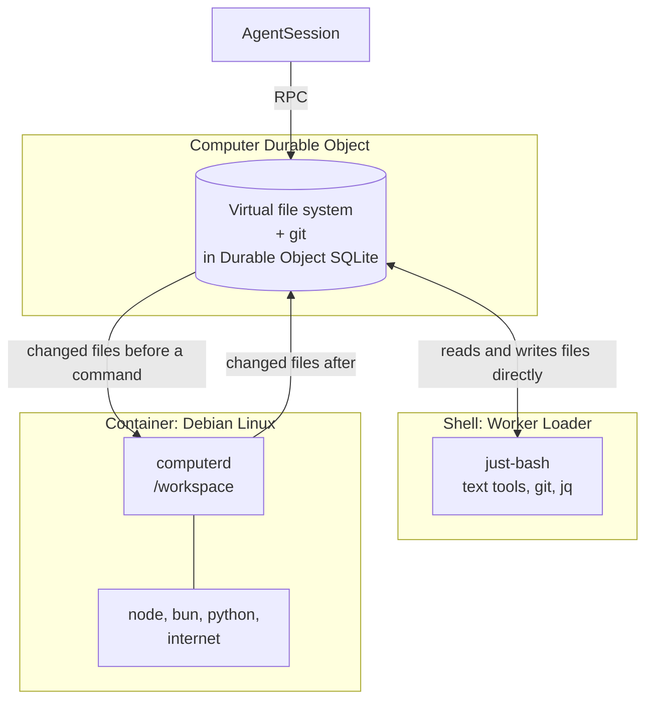

# A coding agent for GitHub, on Cloudflare

Mention the app on an issue or pull request. It reacts 👀, clones the repository into its own Linux workspace, does the work, and answers in the thread. It can push a branch and open a pull request. It also labels new issues and pull requests.

It runs entirely on Cloudflare: Workers, Durable Objects, and a container. [Channels](../../README.md) handles GitHub's webhooks, [Fold](https://github.com/humanlayer/fold) runs the agent, and `@cloudflare/computer` gives it a workspace. It is deployed with [Alchemy](https://alchemy.run).

To run it yourself, see [SETUP.md](./SETUP.md).

## The pieces



Every issue or pull request gets three Durable Objects, all named after it. The numbers follow one mention: (1) the webhook is saved, (2) the mention is handed to the agent, (3–4) the agent thinks and works in its Computer, (5) it reports back, and (6) Channels posts on GitHub.

| Object              | What it holds                                                                 | Code                                                                                       |
| ------------------- | ----------------------------------------------------------------------------- | ------------------------------------------------------------------------------------------ |
| **DeliveryMailbox** | GitHub events for this discussion, in order, until each is handled            | [`DeliveryMailboxDO.ts`](./src/DeliveryMailboxDO.ts), [`GithubBot.ts`](./src/GithubBot.ts) |
| **AgentSession**    | The agent's conversation, the delivery it is working on, and what it has seen | [`AgentSessionDO.ts`](./src/AgentSessionDO.ts), [`DeliveryTurn.ts`](./src/DeliveryTurn.ts) |
| **Computer**        | The cloned repository, its files and git data, and a Linux container          | [`computer/Computer.ts`](./src/computer/Computer.ts), [`Workspace.ts`](./src/Workspace.ts) |

## What happens on a mention



## Channels: from webhook to handoff

Channels turns GitHub's webhooks into an ordered, durable stream per discussion.



- **Saved first.** The Worker checks the webhook signature and saves the event in the discussion's mailbox before anything runs. A crash or deploy loses nothing.
- **One at a time.** A mailbox runs one batch of events at a time. Events within 3 seconds of each other become one batch.
- **Handoff.** The mention callback doesn't run the agent itself. It gives the AgentSession the delivery's ID and a token, then returns a _handoff_. The mailbox keeps the delivery open, and holds later events, until the agent reports back.
- **Delivery API.** The AgentSession reports over HTTP to the Worker's own delivery routes, through a service binding: `PUT …/plan` for the checklist comment, `PUT …/activity` for 👀, and `POST …/complete` or `…/fail` to finish. Channels saves each request, then shows it on GitHub, retrying if GitHub is down.

## The Computer: a workspace on Cloudflare

The agent's workspace is a `@cloudflare/computer` Workspace inside the Computer Durable Object.



- **Files live in SQLite.** The repository's files and git objects are stored in the Durable Object's SQLite, so they persist without a disk. The agent's file tools read and write them directly.
- **The shell starts in milliseconds.** `bash` runs in just-bash, in a Worker that the Worker Loader binding starts on demand. It works on the same files, with text tools and git.
- **The container is for real programs.** `bash` with `backend: "container"` runs in a Debian container with node, bun, python, and internet access, for builds and tests. Before each command the container gets the files changed since the last one; afterwards the files the command changed are copied back.
- **Git goes through the Workspace.** Clone, fetch, pull, and push run in the Computer with the GitHub App's installation token in a request header. The token never appears in a command, a remote URL, `.git/config`, or a log.

The container starts once, right after the first clone, so it is warm when the agent needs it. A Computer idle for 14 days is deleted with its session.

## The agent

The AgentSession runs a [Fold](https://github.com/humanlayer/fold) agent on OpenAI's `gpt-6.1-sol`. Each turn runs in the background, outside the request that started it, and Fold's log is kept in the object's SQLite. A turn cut off by a deploy or crash continues when the object restarts.

**What it sees.** Each request starts with the discussion: all of it the first time, then only what is new. The request itself is every comment posted with the mention, each with its ID. For a line comment that includes the file, line, diff, and review thread.

**Where it works.**

| Discussion   | Branch                                                 | Pull request                                                                         |
| ------------ | ------------------------------------------------------ | ------------------------------------------------------------------------------------ |
| Issue #42    | `humanlayer/issue-42`, created from the default branch | Opens one with `github_create_pull_request` (`Closes #42`), as a draft if it chooses |
| Pull request | The pull request's own branch, pulled on every mention | Pushing updates it. Forks are refused: the app can't push to them                    |

**Its tools.**

| Kind                      | Tools                                                                                                                                                                   |
| ------------------------- | ----------------------------------------------------------------------------------------------------------------------------------------------------------------------- |
| Files and shell           | `read`, `write`, `edit`, `apply_patch`, `bash`                                                                                                                          |
| Git, with the App's token | `git_fetch`, `git_pull`, `git_merge`, `git_push` (its own branch only, never forced)                                                                                    |
| GitHub                    | `github_discussion`, `github_comments`, `github_post_comment` (with `reply_to` for review threads), and, on pull requests, the diff, checks, reviews, and line comments |
| Progress                  | `update_plan`, a checklist comment the agent keeps up to date                                                                                                           |
| Web                       | `web_search`, `web_fetch`, and the repository's skills                                                                                                                  |

Its final answer is posted for it. It uses `github_post_comment` for anything else, such as answering each line comment in its own thread.

## Labels

New issues and pull requests are labeled by [Workers AI's Clef](https://developers.cloudflare.com/workers-ai/) model, which scores each of GitHub's default labels. A label scoring 0.7 or more is added. This needs no mention and no agent.

## Code map

```text
src/
├── Worker.ts                     Ingress Worker: webhook routes and the delivery API
├── GithubBot.ts                  GitHub callbacks: labels, mention access, the request, handoff
├── DeliveryMailboxDO.ts          the mailbox Durable Object
├── AgentSessionDO.ts             the agent: model, tools, system prompt, session start and resume
├── DeliveryTurn.ts               one delivery's turn: send the prompt, report back, recover after restarts
├── DiscussionContext.ts          what's new in the discussion
├── GitHubTools.ts, GitTools.ts   the agent's GitHub and git tools
├── DeliveryPlanTool.ts           update_plan
├── BashTool.ts                   bash on the shell or the container
├── Workspace.ts                  the AgentSession's view of its Computer
├── AutoLabel.ts                  Workers AI labels
└── computer/                     the Computer Durable Object, its Worker, and the container image
```
