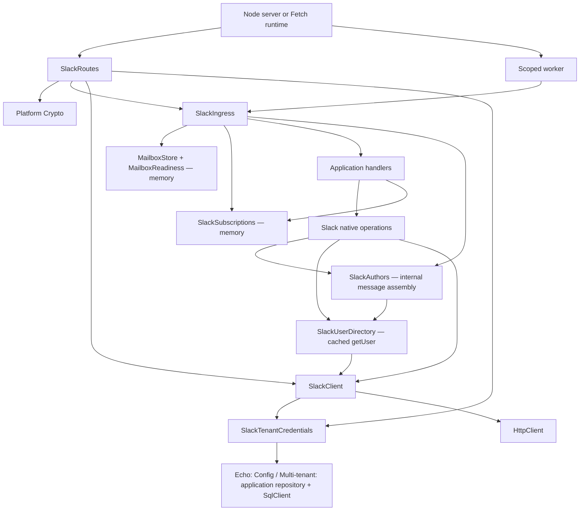

# Native Slack + shared delivery

`@humanlayer/channels-slack` exposes Slack operations, schema-backed handles,
signed webhook routes, and typed handler registration. There is no Channels
facade, provider registry, or app package.

## Outbound only

```ts
import { Slack, SlackClient, SlackTenantCredentials, ThreadId, MarkdownContent } from '@humanlayer/channels-slack'
import { Effect, Layer } from 'effect'
import { FetchHttpClient } from 'effect/unstable/http'

const client = SlackClient.layer.pipe(
	Layer.provide(SlackTenantCredentials.layerFromConfig),
	Layer.provide(FetchHttpClient.layer),
)
const native = Slack.layer.pipe(Layer.provide(client))
const post = Effect.flatMap(Slack, (slack) =>
	slack.post({
		threadId: ThreadId.make('slack:v1:T_WORKSPACE:C_CHANNEL:100.1'),
		content: MarkdownContent.make({ markdown: 'Hello' }),
	}),
).pipe(Effect.provide(native))
```

This needs the bot token and HTTP, not a signing secret, mailbox store,
subscriptions, Node defaults, or a worker. `Thread.post`, `SentMessage.edit`,
reactions, files, history, streaming, and DMs use the same native service.
`Thread.subscribe` separately requires `SlackSubscriptions`. Native history and
handles both return resolved authors automatically. `Slack.getUser` uses one
workspace/user-scoped cache, shared with history and inbound delivery. A miss
fetches the user and caches the profile; concurrent misses share the lookup.

The cache holds at most 1,000 users: successful profiles live for five minutes,
`user_not_found` for one minute, and other failures have zero TTL. An explicit
`getUser` call retains its typed error. Message author resolution keeps the original
author on expected lookup failure, after the failure has been logged; defects and
interruption still propagate. There is no optional hydration step or second shared
cache to configure. The old `UserProfileCache` contract is retained only for the
historical Postgres adapter, not used by the native runtime.

## Inbound hosting

The normal memory-host API is intentionally small:

```ts
import { SlackBot, MarkdownContent, type MessageEvent } from '@humanlayer/channels-slack'
import { Effect } from 'effect'

const bot = SlackBot.memory({
	namespace: 'my-slack-bot',
	handlers: {
		onNewMention: ({ thread, message }: MessageEvent) =>
			Effect.gen(function* () {
				yield* thread.subscribe()
				yield* thread.post(MarkdownContent.make({ markdown: `Hello ${message.author.fullName}` }))
			}),
	},
})
```

`bot.layer` mounts the webhook and starts a scoped worker. Hosts provide
`SlackClient`, `SlackTenantCredentials`, and platform `Crypto`; custom handler
services remain in the Layer's requirements. Nothing launches at import time.
`policy` and `runner` accept partial overrides of the bounded memory preset.
This is Slack-specific composition, not a universal provider facade or agent runtime.

Single callbacks use stable IDs: `mention`, `subscribed`, `dm`, `edited`, `deleted`,
`reaction`, and `stopped`. For multiple handlers, pass arrays of `{ id, handler }`;
reaction registrations also accept `emojis`. IDs must be unique across the bot.
Filtering is inside the registered delivery handler, so retries retain the same
admission identity. Avoid renaming IDs while work is outstanding.

Advanced applications can still compose the lower-level services:

1. `SlackIngress.layer({ namespace, policy, handlers })` binds stable handler IDs
   and native event schemas to shared delivery.
2. Supply delivery `/memory`, `SlackSubscriptions.layerMemory`, and `Slack.layer`.
   Slack supplies its internal user-resolution services itself.
3. Mount `SlackRoutes.layer` in Effect HTTP. It verifies the original body and
   commits all required admissions before returning success; it starts no worker.
4. Explicitly run `SlackIngress.run({ scanLimit, concurrency, pollMs })` in the
   host's scope. It awaits handlers and finalizes active fibers on shutdown.
   Each handler invocation receives its own scope, including when it uses captured
   application services. Invalid delivery policies fail ingress Layer acquisition.

`HttpRouter.toWebHandler(bot.layer)` supplies a standard
`Request → Promise<Response>` function for Hono or another Fetch host. The host
must supply the transport Layer and await the returned `dispose()` on shutdown.
For separate admission/execution, use `bot.routes` and `bot.worker` with one shared
Layer memo map. `bot.services` exposes the acquired services for advanced composition.
Do not reconstruct the Layer graph for every request.

Message queue behavior is latest plus `context.skipped`, not FIFO. Lifecycle
callbacks are serial per handler. Different handler IDs are independent; no
cross-handler execution order is promised. Mentions do not implicitly subscribe.
Other bots remain eligible; only this installation's own echoes are suppressed.
Routing decisions are remembered across retries, including mention/message twins
and proactive-DM subscription changes. Memory routes are installation/channel
scoped and retained for one day by default; configure routing retention to cover
your provider replay window. Memory is volatile and capacity bounded.

Ephemeral-to-DM fallback requires explicit `EphemeralFallbackToDm`; it is never
an implicit persistent write. A duplicate Stop cannot cancel a successor attempt.
There is no exactly-once guarantee for external Slack writes.
Explicit stream-source retryability is preserved; a non-retryable source failure
does not become retryable merely because it passed through Slack streaming.

The multi-tenant example supplies an application-owned credential lookup through
`SlackTenantCredentials.layerWithLookup`. It preserves ambient requirements and
caches successful workspace lookups (including missing installations) for one minute.
Failed lookups have zero cache TTL so a recovered repository can serve the next
request. OAuth is not implemented.

## Service graph

Arrows below mean **depends on**, except the worker's invocation of ingress.
`SlackBot.memory` assembles the shared native/delivery subtree once. The routes and
worker reuse that subtree; application handlers do not construct Layers.



The host owns shutdown. Handler scopes finish before delivery records success or
failure; cancellation renews ownership until cleanup completes. The multi-tenant
SQL pool stores credentials only. Memory delivery is not process durability and
does not make external Slack writes exactly-once.
