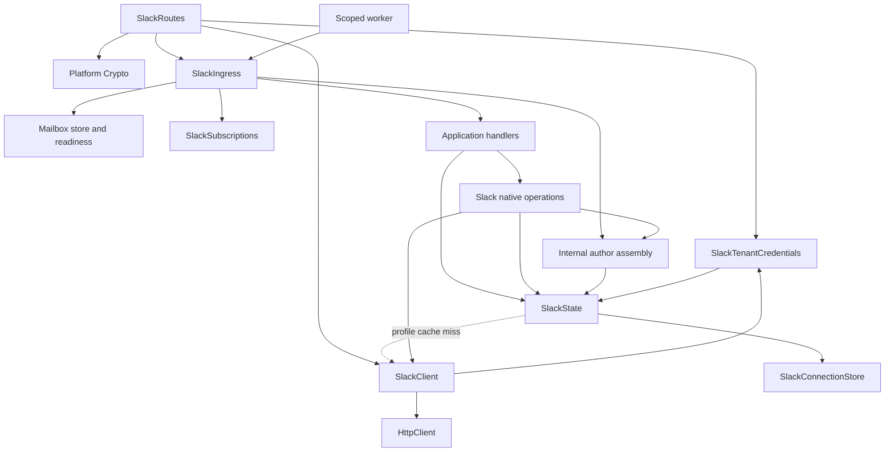

# Native Slack and shared delivery

One provider-native bot definition works with memory, Postgres, Redis, or custom
storage. Applications own handlers and host resources—not credential rows,
cache plumbing, webhook context, or delivery algorithms.

## Define behavior, then choose storage

```ts
import { SlackBot, MarkdownContent, type MessageEvent } from '@humanlayer/channels-slack'
import { Effect } from 'effect'

export const bot = SlackBot.make({
	namespace: 'my-bot',
	handlers: {
		onNewMention: ({ thread, message }: MessageEvent) =>
			Effect.gen(function* () {
				yield* thread.subscribe()
				yield* thread.post(MarkdownContent.make({ markdown: `Hello ${message.author.fullName}` }))
			}),
	},
})
```

Supply **one storage bundle**, an `HttpClient`, and platform `Crypto` at the host:

| Import                                | `layer` provides                                                  | Requirements                         |
| ------------------------------------- | ----------------------------------------------------------------- | ------------------------------------ |
| `@humanlayer/channels-slack/memory`   | Connection store, subscriptions/routing, delivery store/readiness | None; `layer(options?)` is a factory |
| `@humanlayer/channels-slack/postgres` | Same services, backed by versioned SQL tables                     | Ambient `SqlClient.SqlClient`        |
| `@humanlayer/channels-slack/redis`    | Same services, backed by Redis                                    | Ambient neutral `Redis.Redis`        |

The backend modules also export `connections` and `subscriptions` individually.
Memory exports `connections(options?)`, `subscriptions(options?)`,
`connectionsFromConfig`, and `layerFromConfig`. The config recipes read
`SLACK_TEAM_ID`, `SLACK_BOT_TOKEN`, `SLACK_BOT_USER_ID`, and `SLACK_BOT_ID`; they
bootstrap a real mutable memory store, not a wildcard credential loader.

`bot.layer` mounts signed routes and starts a scoped worker. Advanced hosts can
use `bot.routes` (admission only), `bot.worker`, and `bot.services` separately,
sharing the same Layer memo map. Callbacks retain ambient application service
requirements. `policy` and `runner` accept partial overrides. Nothing starts at import.

Single callbacks have stable IDs: `mention`, `subscribed`, `dm`, `edited`,
`deleted`, `reaction`, `stopped`. Arrays use `{ id, handler }`; reaction entries
also accept `emojis`. Keep IDs unique and stable while work is outstanding.
The older `SlackBot.memory` convenience fixes memory delivery/subscriptions but
still requires a connection store and HTTP. Prefer `make` plus a storage bundle.

## Connection storage: the required custom seam

`SlackConnectionStore` has exactly three operations:

```ts
get({ workspaceId }): Effect<SlackConnection | undefined, SlackConnectionStoreError>
upsert({ workspaceId, connection }): Effect<void, SlackConnectionStoreError>
remove({ workspaceId }): Effect<void, SlackConnectionStoreError>
```

`SlackConnection` contains `credentials: { botToken, botUserId, botId }`.
The token is `Redacted<string>`. Implement `SlackConnectionStore` with an ordinary
`Layer.effect` over your repository. Return domain records—not SQL rows or SDK
objects. Upserts must be atomic, removals idempotent, and reads authoritative.
Map and safely capture repository failures at that boundary. Applications with
custom schemas own only this translation, not Slack's cache or request logic.

For standard storage, use the supplied implementations instead. Their schemas,
codecs, migrations, TTLs, and atomic statements/scripts are private to the library.
Memory connections never expire or evict: capacity rejects new installations,
upsert replaces an existing one, and removal frees capacity.

For installation lifecycle operations, use **`SlackState`**:

```ts
const state = yield * SlackState
yield * state.upsertConnection({ workspaceId, connection })
yield * state.removeConnection({ workspaceId })
```

The service owns connection access and the single disposable user cache. Writes
invalidate affected workspace profiles, including when a write fails ambiguously
or is interrupted. **Credentials and missing installations are not TTL-cached.**
Inbound requests and outbound API calls consult the authoritative store. A new
request after removal cannot use a cached token; already-started requests are not
revoked transactionally. There is no automatic cancellation/deletion of that
installation's pending work or subscriptions on removal.

The internal `SlackTenantCredentials.layer` bridges state to provider requests.
Legacy read-only `layerWithLookup`/`layerFromConfig` remain for compatibility;
the former retains its one-minute cache and neither is the new mutable-store path.
Neither is used by the examples. OAuth installation UI, rotation, ownership
authorization, and enterprise policy remain later phases. Do not expose unauthenticated
endpoints for `upsertConnection` or `removeConnection`.

## Users: request them, do not hydrate them

`Slack.getUser` and inbound/history author assembly share `SlackState`'s cache:
1,000 entries; profiles cached five minutes; `user_not_found` one minute; other
failures zero TTL. Concurrent same-key lookups share a request. Keys include the
workspace, user, redacted token and bot identity. Every lookup checks installation
presence first. The HTTP lookup is privately pinned to the authorization snapshot
used for its cache key, so a concurrent credential change cannot poison another
installation version's entry. No plaintext tokens appear in Redis/cache key strings.

Direct `getUser` preserves typed failures. Message author assembly falls back to
the original author on expected lookup failure, after safe logging; defects and
interruption propagate. `SlackUserDirectory` is a compatibility name for `SlackState`,
not a second cache. The old caller-managed `UserProfileCache` remains as a legacy
API with memory regression tests; native runtime code does not use it. Its former
SQL consumer is retired to Git history at `e7894f0` / `f27947c`, not an active
workspace package. See the root README before migrating old stored data.

## Outbound only

```ts
import { Slack, ThreadId, MarkdownContent } from '@humanlayer/channels-slack'
import { connectionsFromConfig } from '@humanlayer/channels-slack/memory'
import { Effect, Layer } from 'effect'
import { FetchHttpClient } from 'effect/unstable/http'

const native = Slack.layerFromStore.pipe(Layer.provide(connectionsFromConfig), Layer.provide(FetchHttpClient.layer))
const post = Effect.flatMap(Slack, (slack) =>
	slack.post({
		threadId: ThreadId.make('slack:v1:T_WORKSPACE:C_CHANNEL:100.1'),
		content: MarkdownContent.make({ markdown: 'Hello' }),
	}),
).pipe(Effect.provide(native))
```

This acquires no mailbox store, subscriptions, signing secret, platform crypto,
Node defaults, or worker. Low-level `Slack.layer` / `SlackClient.layerWith` remain
available for custom native transport composition.

## Hosting and delivery guarantees

After supplying host dependencies, `HttpRouter.toWebHandler(bot.layer)` provides
standard `Request → Promise<Response>` hosting. Forward the original signed body
unchanged and await `dispose()` during shutdown. Do not construct a runtime per request.

All required admissions commit before ACK; partial fan-out fails with a retryable
response and retries repair missing admissions. Queue means latest pending plus
`context.skipped`, not FIFO. Lifecycle callbacks remain serial per handler.
Subscriptions are explicit. Routes remember initial decisions across retries and
proactive-DM changes. A duplicate Stop cannot cancel the next attempt. Handler
finalizers finish before completion; cancellation renews ownership during cleanup.
Ephemeral-to-DM fallback requires explicit `EphemeralFallbackToDm`.

No backend makes external Slack writes exactly-once. See the
[delivery guarantees](../delivery/README.md) and backend test READMEs for retention,
Redis persistence/eviction requirements, single-slot limits, and clock assumptions.

## Packaging and verification

Root and memory export built ESM plus declarations without optional drivers.
Postgres/Redis imports require only neutral Effect services. `/postgres/client`
and `/redis/client` are explicit optional platform conveniences. Install
`@effect/sql-pg` plus `@types/pg` for the former; `@effect/platform-node` plus
node-redis `redis` for the latter. All Effect packages must match rc.112.

Default tests use memory and Emulate, never ambient database URLs. `bun run
verify:exports` packs and installs real isolated consumers, checks strict NodeNext
and bundler declarations, import-time inertness, one Effect runtime, cross-entry
service identity, and browser output without SQL/Redis/Node/Alchemy code.
Effect's barrel has additional tree-shaken neutral modules; the verifier distinguishes
parsed inputs from emitted bytes rather than claiming every parsed file ships.

`bun run test:backend:postgres` and `bun run test:backend:redis` create fresh local
Docker containers for each suite, reject occupied ports, and remove their containers
and anonymous volumes on completion. They do not use `DATABASE_URL` or `REDIS_URL`.

## Service graph



The profile client dependency is supplied at lookup, not State acquisition, so
this call relationship is not a circular Layer construction. `SlackBot.make`
owns assembly. The selected storage bundle implements Connections, Subscriptions,
and Delivery; the host owns HTTP, crypto, pool/Redis connection and shutdown.

## Organization lookup

`SlackOrganizations` is an optional, independently supplied Effect service. With no override, verified admitted events belong to `default`. For another single organization, provide `SlackOrganizations.fixed({ organizationId: 'my-organization' })` to the bot's services/routes/worker composition. This fixed layer also explicitly attributes legacy unowned work to that organization.

A multi-organization application supplies its own Layer:

```ts
import { SlackOrganizations } from '@humanlayer/channels-slack'
import { Effect, Layer } from 'effect'

const organizations = SlackOrganizations.layer(({ workspaceId }) =>
	Effect.gen(function* () {
		const directory = yield* ApplicationDirectory
		return yield* directory.findOrganization({ workspaceId })
	}),
)

const services = bot.services.pipe(Layer.provide(organizations))
```

`ApplicationDirectory` represents an existing application dependency, not a required new service. The callback accepts native branded `SlackTeamId` and returns `Effect<SlackOrganization | null, E, R>`. `layer` infers and captures `R` once at Layer construction; provide those dependencies privately with `Layer.provide`. It owns the `slack.organizations.resolve` span, safe failure classification, result decoding, and mapping application errors to `SlackOrganizationLookupError`. No callback error mapping or user span is required. Direct custom Layers and `.fixed` remain compatible. Provide the organization Layer consistently to routes and workers, not only handlers; credentials and delivery storage remain independent.

The lookup occurs during verified ingress, before fan-out admission. Positive attribution is saved in delivery storage and reused across duplicate delivery, partial fan-out, and handler retry. An unknown mapping returns HTTP 200 without admitting handler work; expected typed lookup/storage failures retain HTTP 503. `SlackOrganizations.layer` suspends the callback and catches causes, including synchronous throws before it returns an Effect. Defects are safely classified as `unexpected_defect` and carried as optional `reason: 'unexpected'` through lookup/ingress errors to an empty HTTP 500 at the webhook route. Omitted reason retains unavailable behavior, including existing `SlackOrganizationLookupError.make({})` callers. Interruption takes priority over failure/defect classification and preserves cancellation without lookup-failure recovery or logging. A configured lookup never falls back to the default after returning null or failing. Signature verification and credential checks are unchanged. Handlers receive `context.organizationId` without changing native events or handles.

Custom lookup results are decoded as `SlackOrganization | null` before any attribution write. Undefined, malformed, or empty-ID results fail rather than mean absence. Diagnostics report fixed classifications, not application error messages or returned data. The exported lookup/organization schemas have same-name inferred interfaces; `fixed` still validates configuration with `makeEffect` and retains its rc.112 `SchemaIssue.Issue` error type. The extracted ingress-attribution effect is package-internal, not an additional public API or service.

Stop events pass organization lookup before cancellation: an unknown or failed lookup cannot mutate the active mailbox. Existing native-mailbox Stop targeting is unchanged; organization attribution is not a new authorization policy. Delivery also refuses to claim a batch whose selected envelopes have different organizations rather than silently splitting membership or changing mailbox identity.

The native service stays in the Slack package: it imports only Effect and the existing identity codec. GitHub supplies its analogous `GitHubOrganizations` service with native numeric installation IDs. Generic delivery imports neither provider. Application callbacks can supply both provider Layers without a registry, universal installation ID, facade, or package cycle; see [the executable organization recipe](../../examples/organization-lookup/README.md). Custom-directory legacy work fails closed rather than inventing an owner; automatic one-time migration remains deferred behind that explicit upgrade gate. See the delivery README for v3 upgrade instructions and the attribution-record retention limitation.
